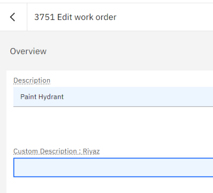
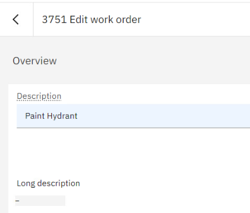
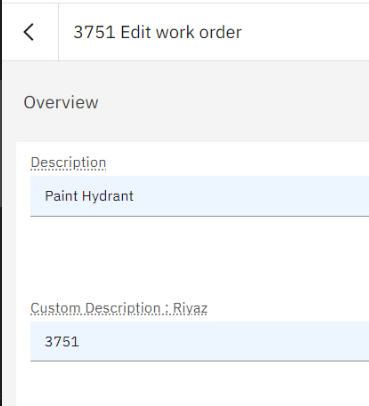
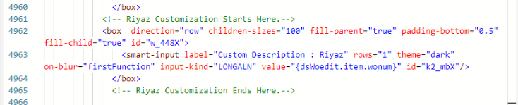

1. Change label of one field.
    
1. Hide existing field.
    
1. Add existing field in obj on UI - view.
    
    
1. Add new field in Mx and add the field in UI - edit.
1. Conditional enable field.
1. Make field mandatory.
1. Make field conditionally mandatory.
1. Associate lookup.
1. Additional validation on save.
1. Additional validation on value change.
1. Custom section with custom object.

